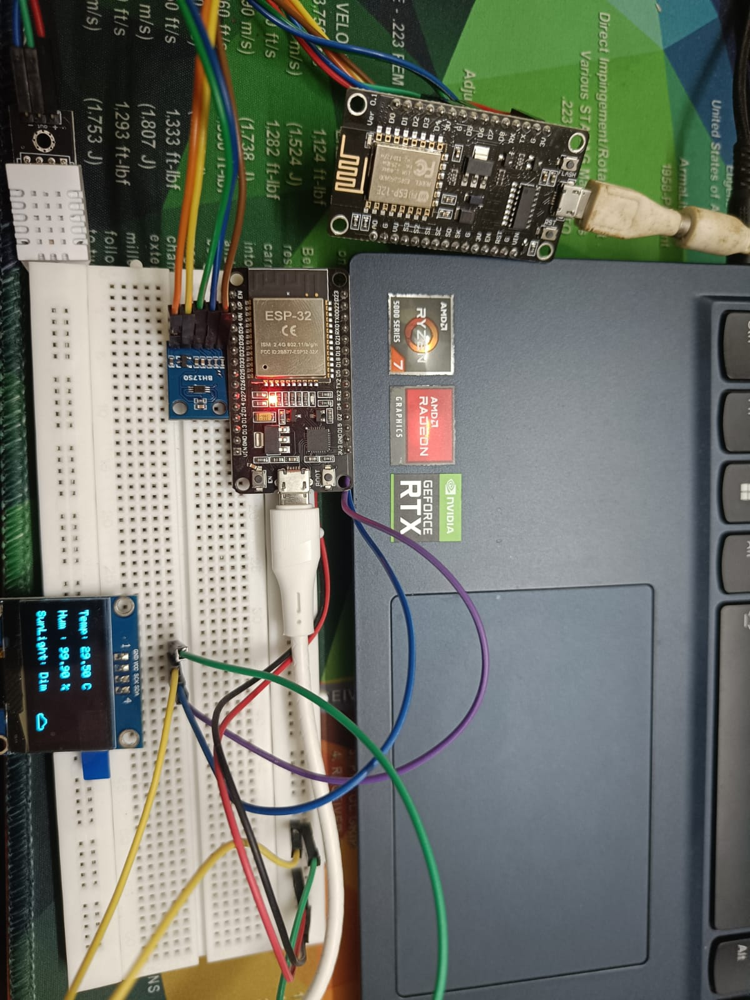

# 🌱 IoT Roots #2 – ESP8266 to ESP32 Weather Display

This project is part of the **IoT Roots Series**, where we start from simple IoT communication projects and gradually build toward a **complete Agri-IoT system** 🌾.  

In this project:  
- **ESP8266** reads temperature & humidity data from a **DHT22 sensor** and luminosity from a **BH1750**.  
- The readings are transmitted wirelessly via **ESP-NOW**.  
- **ESP32** receives the data and displays it on an **OLED screen** in real time.  

---

## 🖼️ Demo Setup

- ESP8266 (DHT22 + BH1750) -> ESP-NOW -> ESP32 (OLED Display)

# </img>


---

## 🚀 Features
- 📡 **ESP-NOW communication** between ESP8266 and ESP32.  
- 🌡️ **DHT22 sensor integration** for temperature & humidity. 
- 💡  **BH1750 sensor** for luminosity levels.
- 🖥️ **OLED display** for real-time visualization.  
- 🔌 Beginner-friendly stepping stone toward **Agri-IoT automation**.  

---

## 🛠️ Technologies Used
<div align="center">


</div>

---

## 📂 Project Structure
```
IoT-Roots-1-ESP8266-ESP32-Weather-Display/
│── ESP8266_Sender/ # Code for ESP8266 (DHT22 + ESP-NOW TX)
│── ESP32_Receiver/ # Code for ESP32 (ESP-NOW RX + OLED Display)
│── README.md # Project documentation
```


---

## ⚡ Setup & Instructions

### 1. Requirements
- ESP8266 board  
- ESP32 board (board version: **2.0.17**)  
- DHT22 sensor
- BH1750 sensor
- OLED Display (SSD1306, I2C)  
- Arduino IDE  

### 2. Get MAC Address
Before uploading the codes:  
- Upload `GetMAC.ino` to each board.  
- Open **Serial Monitor** to see the **MAC Address**.  
- Convert it into **hexadecimal format** (if required).  
- Replace the address inside the code accordingly.  

### 3. Upload Codes
- Flash **ESP66-v2** code to ESP8266.  
- Flash **ESP32-v2** code to ESP32.  

---

## 📊 Output
- ESP8266 reads `Temperature + Humidity + Luminosity`.  
- ESP32 displays results like:
  -- Temp: 28.4°C
  -- Humidity: 65.2%
  -- SunLight: Dark/Dim/Cloudy/Sunny
- 
on the OLED in real time.  

---

## 🔮 Next Steps in IoT Roots Series
- 🌱 #2: Soil Moisture + OLED Monitoring  
- 🌱 #3: Automated Plant Watering System  
- 🌱 #4: Mini Smart Greenhouse  

---

## 🤝 Contributing
This is part of my **learning + portfolio journey**. Suggestions and improvements are always welcome!  

---

## 📜 License
This project is licensed under the **MIT License**.  

  
  


